# dr-restaurant
2022年华南理工大学"灵犀互娱杯“程序设计大赛二等奖参赛作品

致敬了本人小时候非常喜欢的一款像素风游戏——吃货大食堂

### 设计介绍

----

游戏名为：梦想的餐厅，模拟经营类游戏.

在不能引入任何高度封装的**第三方外部库**的比赛要求下，通过**纯C++代码**的命令行实现具有高清流畅的**字符**画面显示的Windows**控制台命令窗口**游戏。

-  游戏框架：搭建了UI显示控制单元、资源管理单元、交互控制单元、游戏引擎等的基础框架,提高游戏开发效率和系统性能。

- 游戏画面：以字符画输出的形式实现流畅的画面显示。应用双缓冲技术解决画面频闪问题。实现了游戏画面的分层化渲染。

- 游戏引擎：实现了碰撞体积与碰撞检测的2.5D游戏处理引擎。基于Astar算法实现了游戏NPC自动寻路功能等。

#### **游戏玩法、内容结构图**

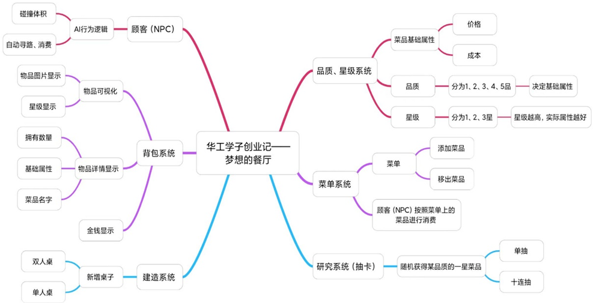

#### **游戏框架**

​	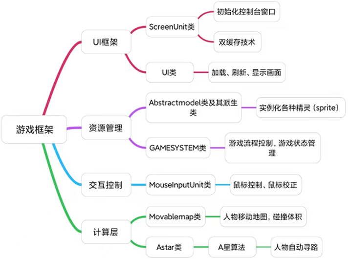					

#### UI展示

<table frame=void>	<!--用了
进行封装-->
	<tr>
        <td>

	<!--每个格子内是图片加标题-->
        	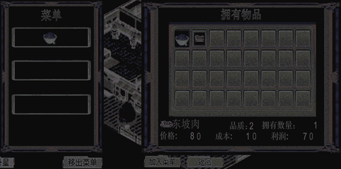	<!--高度设置-->
        

</td>    
     	<td>

	<!--第二张图片-->
    		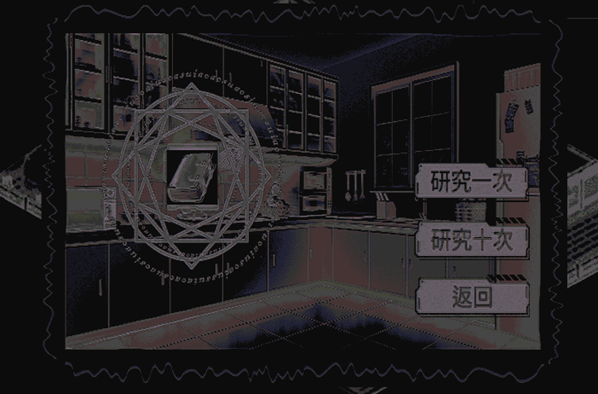	
        

</td>
	</tr>
</table>

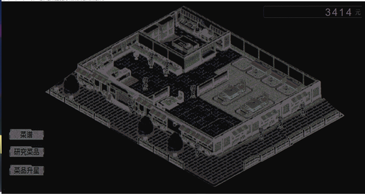

### 技术实现

---

ps:	内容较长，从报告文档中摘取出来

#### 1. 前期准备——模型资源

利用ASCII Generator软件将模型相应的图片转化成字符画，以文本的形式储存在txt文档中，在程序运行的时候进行加载。

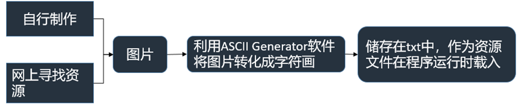

<table frame=void>	<!--用了
进行封装-->
	<tr>
        <td>

	<!--每个格子内是图片加标题-->
        	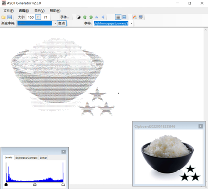	<!--高度设置-->
        	 	<!--换行-->
        	将图片转化成字符画	<!--标题1-->
        

</td>    
     	<td>

	<!--第二张图片-->
    		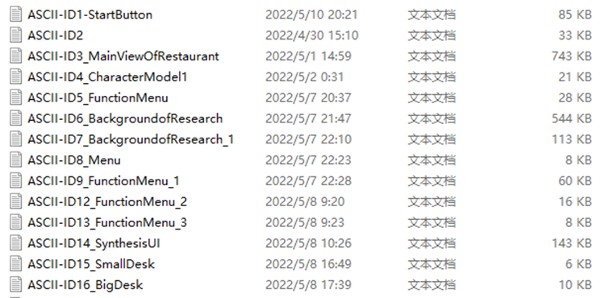	
    		 
    		字符画以text的格式存储起来
        

</td>
	</tr>
</table>

#### 2. UI框架

由于赛题要求不能引入任何高度封装的**第三方外部库**, 甚至一些简单的图像处理的库都不允许，如何实现游戏画面的显示就成为了一大难题。于是，本项目决定手撸复现一个UI内核框架。

##### 2.1 画面

**字符模拟像素。**将控制台的字符大小设置为最小，以屏幕左上角为原点建立如图坐标系，每一个坐标点的字符对应于画面中的一个”像素“。

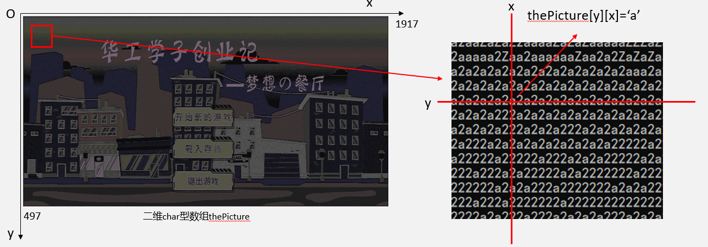

##### 2.2 双缓冲技术（？华工软院祖传技术）

游戏动画实现原理：利用人视觉暂留效应，通过控制台不断刷新并输出不同的字符画面，实现游戏动画的流畅显示。

但是，在实现过程中发现，由于控制台字符输出速度有限，字符输出速度比画面刷新速度慢，导致游戏画面出现闪屏的问题，于是采用双缓冲技术解决此问题。双缓冲技术是一种使用两个缓冲区的图形渲染技术，通过在后缓冲区进行绘制，并在绘制完成后将其内容复制到前缓冲区，实现平滑的图形更新，避免画面闪烁和绘图不连贯的问题。

<table frame=void>	<!--用了
进行封装-->
	<tr>
        <td>

	<!--每个格子内是图片加标题-->
        	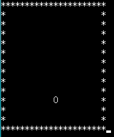	<!--高度设置-->
        	 	<!--换行-->
        	频闪问题	<!--标题1-->
        

</td>    
     	<td>

	<!--第二张图片-->
    		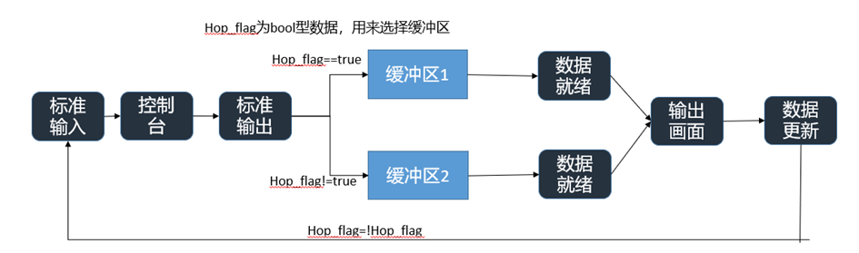	
    		 
    		双缓冲技术
        

</td>
	</tr>
</table>

##### 2.3 画面的分层化渲染（图层渲染内核）

**按照层次结构绘制和呈现游戏对象。**每个游戏对象都被分配到特定的图层，然后按照指定的顺序逐个渲染这些图层，以创建正确的遮挡和叠加效果。当然，这个方法缺点也很明显，会导致"over-rendering"（过度渲染），此方法会增加内存占用，增加复杂性和额外的管理开销、性能开销、渲染顺序限制。但是，由于当时本人才大一并且比赛时间有限，并没有进一步解决这个问题。概括地说，就是一层一层地贴图。

##### 2.4 人物移动动画

在每个游戏帧中，根据当前位置和动画帧序列的当前帧，绘制正确的帧图像来显示人物的移动动画。

<table frame=void>	<!--用了
进行封装-->
	<tr>
        <td>

	<!--每个格子内是图片加标题-->
        	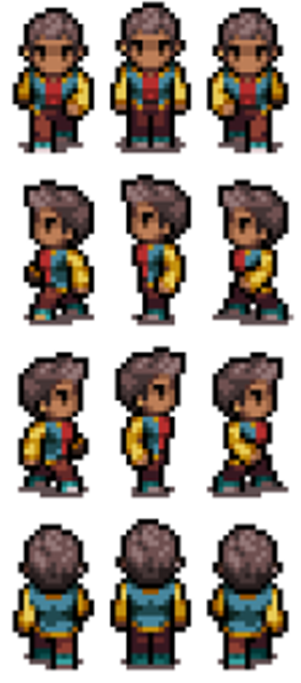	<!--高度设置-->
        	 	<!--换行-->
        	动画帧序列	<!--标题1-->
        

</td>    
     	<td>

	<!--第二张图片-->
    		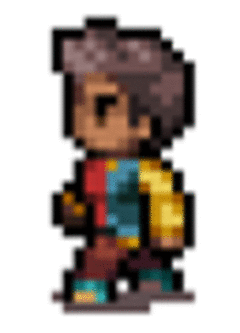	
    		 
    		控制帧的播放
        

</td>
	</tr>
</table>

#### 3.计算层内核

##### 3.1 核心业务逻辑

##### 3.2 基于A星算法的人物自动寻路

**碰撞体积。**用一个二维数组表示人物可移动地图，0表示可通，1表示障碍物(碰撞体积）。

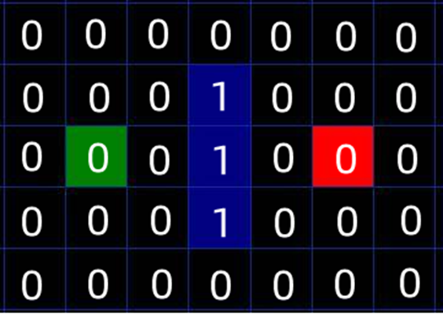示例：绿色为起点，红色为终点，蓝色为障碍物

**A星算法**(Astar)。

约定：水平移动一格长度为10

量化路径 F = G + H

G = 从起点 A 移动到指定方格的移动代价（两点之间的距离），沿着到达该方格而生成的路径。

H = 从指定的方格移动到终点 B 的估算成本（只走横向和竖向的距离,且忽视障碍物）。

F最小的方格即为下一步落点.

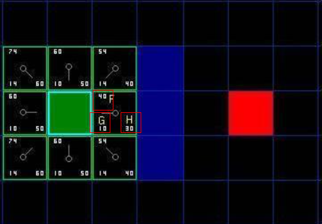

参考：[**"A* 寻路算法"**](http://www.cppblog.com/christanxw/archive/2006/04/07/5126.html )

#### 4.鼠标控制实现

通过获取鼠标事件，如点击坐标等等信息，实现了一个用于响应鼠标操作的内核。

在使用不同电脑测试的过程中，发现鼠标的移动出现一些偏差或不准确性，导致程序获取鼠标的坐标出现偏移的情况。为了确保准确，在游戏开始之前设计了一个鼠标校正的环节。

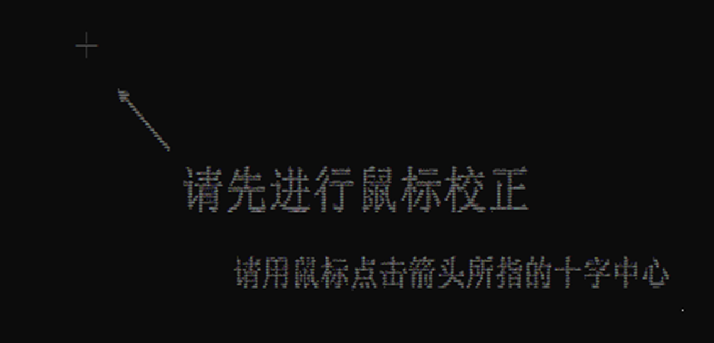

#### 5. 模块化 

参考了一些游戏设计软件中”精灵(Sprite)“的做法，在设计游戏架构的时候，为了提高开发效率，使用模块化的设计，将与模型相关的元素绑定在一起(如：图像和动画、位置和尺寸、碰撞检测、对鼠标事件的响应、动作和行为、状态和属性等等)。

### 不足与改进

----

- 由于时间限制，游戏中的一些内容只能以阉割版的形式呈现。例如，一些动画没有加入进去，某些UI界面弹窗直接使用了Windows中的MessageBox来代替。此外，游戏中还有很多尚未开发完成的内容，这些内容将在后续的开发过程中逐步实现。
- A星算法效率低，并且是针对静态地图计算路径的。可以使用D星算法来实现一个动态的路径搜索。
- 图层的画面渲染，存在过度渲染的问题，效率低。可以通过优化渲染逻辑、减少渲染对象的数量或调整渲染触发的条件来减少不必要的渲染操作。

